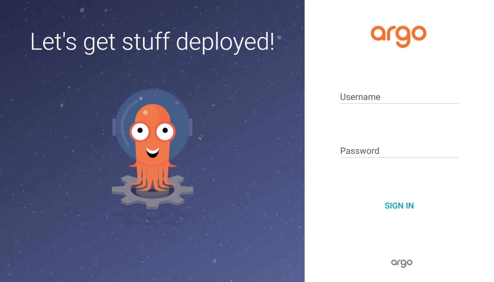
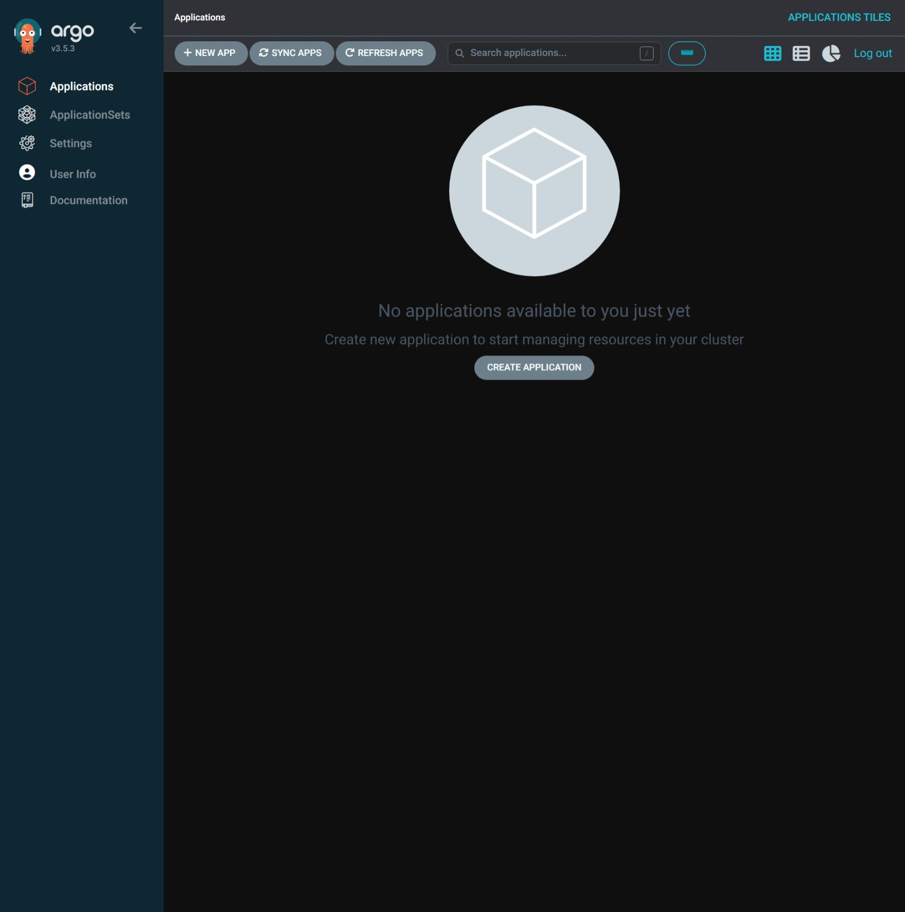
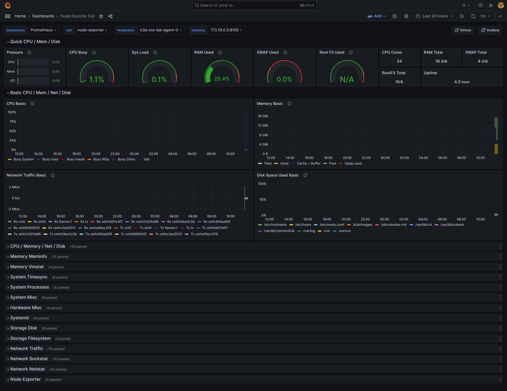
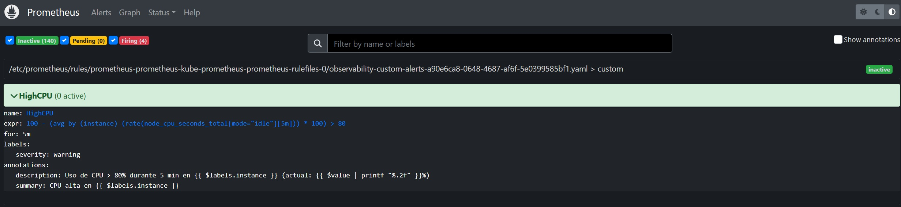
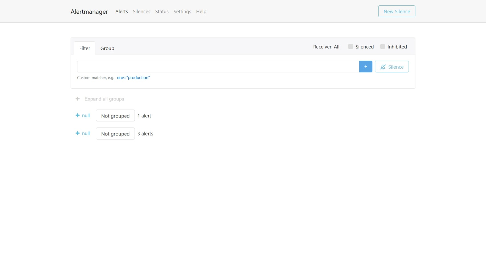
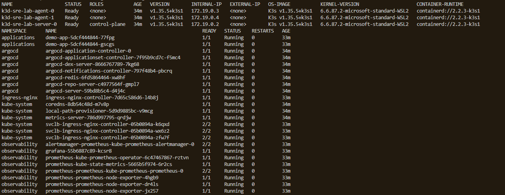

# SRE Observability Platform


Plataforma SRE desplegada en Kubernetes con GitOps, monitorización y auto-remediación.

Todo el proyecto está gestionado como código y actualmente se encuentra **en desarrollo**.

---

## Estado del proyecto

🟡 **Proyecto en desarrollo**

La infraestructura principal está desplegada y funcionando, incluida la primera tanda de reglas de alerta propias y el datasource de Prometheus en Grafana. Queda pendiente versionar el dashboard en Git, y todo el bloque de event-driven automation y auto-remediación.

### Objetivos cumplidos

* [x] Crear cluster Kubernetes con K3d
* [x] Crear estructura base del proyecto
* [x] Crear namespaces de Kubernetes
* [x] Instalar ArgoCD
* [x] Configurar GitOps con ArgoCD (App-of-Apps)
* [x] Desplegar aplicación de demostración
* [x] Instalar Nginx Ingress
* [x] Instalar Prometheus
* [x] Instalar Grafana
* [x] Instalar Alertmanager
* [x] Instalar Node Exporter
* [x] Instalar kube-state-metrics
* [x] Configurar monitorización de los nodos
* [x] Configurar monitorización de Kubernetes
* [x] Comprobar targets de Prometheus
* [x] Comprobar métricas mediante PromQL
* [x] Crear reglas de alerta propias con `PrometheusRule` (`HighCPU`, `HighMemory`)
* [x] Configurar el datasource de Prometheus en Grafana
* [x] Verificar despliegues mediante ArgoCD
* [x] Verificar el rebuild completo desde cero

### Objetivos pendientes

* [ ] Versionar el dashboard de Grafana en Git
* [ ] Añadir alertas en Grafana
* [ ] Configurar webhooks de Alertmanager
* [ ] Conectar Alertmanager con EDA
* [ ] Crear `ansible-rulebook`
* [ ] Crear playbooks de remediación con Ansible
* [ ] Probar el flujo completo de auto-remediación
* [ ] Simular una incidencia real en Kubernetes
* [ ] Verificar que la alerta llega a Alertmanager
* [ ] Verificar que EDA recibe el evento
* [ ] Ejecutar automáticamente el playbook de Ansible
* [ ] Documentar el flujo completo de recuperación
* [ ] Añadir observabilidad de logs
* [ ] Valorar integración con Elasticsearch
* [ ] Mejorar dashboards de Grafana
* [ ] Añadir más métricas de Kubernetes
* [ ] Añadir métricas de la aplicación `demo-app`
* [ ] Añadir tests de infraestructura
* [ ] Mejorar seguridad de credenciales
* [ ] Evaluar despliegue en cloud (AWS, Azure o GCP)

> **Sobre el dashboard de Grafana:** la captura de abajo se creó cuando Grafana venía dentro
> de `kube-prometheus-stack`, que lo aprovisionaba automáticamente. Ahora Grafana se despliega
> como aplicación independiente (chart `grafana` 7.0.19). El **datasource** sí está provisionado
> desde Git y sobrevive a cada rebuild, pero el **dashboard** se importó a mano y **no está
> versionado**: al recrear el cluster hay que volver a importarlo. Ver
> [Dashboards](#dashboards).

---

## Capturas

### ArgoCD — Login

Pantalla de acceso a ArgoCD.



### ArgoCD — Aplicaciones desplegadas

Aplicaciones gestionadas mediante GitOps y sincronizadas desde Git.



### Grafana — Dashboard

Dashboard inicial para visualizar las métricas de la infraestructura Kubernetes.
*Captura del despliegue anterior a la separación de Grafana como app independiente.*



### Prometheus — CPU Usage

Consulta de métricas de utilización de CPU mediante PromQL.



### Alertmanager — Alertas

Alertas gestionadas por Alertmanager, con los grupos y firing rules del clúster.



### Kubernetes

Estado de los pods desplegados en el cluster.



---

## Arquitectura

```text
                          ┌─────────────────────┐
                          │        GitHub       │
                          │  fuente de verdad   │
                          └──────────┬──────────┘
                                     │  pull cada ~3 min
                                     ▼
┌──────────────────┐       ┌─────────────────────┐
│      Usuario     │──────▶│      ArgoCD        │
└──────────────────┘       └──────────┬──────────┘
                                      │  renderiza charts
                    ┌─────────────────┼─────────────────┐
                    ▼                 ▼                 ▼
             ┌────────────┐   ┌────────────┐   ┌────────────┐
             │     App    │   │     App    │   │     App    │
             │ prometheus │   │  grafana   │   │  demo-app  │
             └─────┬──────┘   └──────┬─────┘   └────────────┘
                   │                 │
                   │          ┌──────▼─────┐
                   │          │  Ingress   │
                   │          │  (nginx)   │
                   │          └──────┬─────┘
                   │                 │
     ┌─────────────┼───────────┐     │
     │             │           │     │
     ▼             ▼           ▼     ▼
┌─────────┐  ┌────────────┐  ┌────────────┐  ┌────────┐
│  Alert  │  │ Prometheus │  │ kube-state │  │demo-app│
│ manager │  │            │  │  -metrics  │  │        │
└────┬────┘  └─────┬──────┘  └────────────┘  └────────┘
     │            │
     │  scrape    │
     │            ▼
     │      ┌───────────┐
     │      │  3 × Node │  (1 server + 2 agents)
     │      │  Exporter │
     │      └───────────┘
     │
     │  webhook
     ▼
┌────────────┐
│     EDA    │   ← pendiente
└─────┬──────┘
      │  ejecuta
      ▼
┌────────────┐
│   Ansible  │   ← pendiente
└────────────┘
```

### Cómo encaja el App-of-Apps

`root-app` no instala Prometheus: instala las **Applications** que instalan Prometheus. Hay
dos capas, cada una con su propio ciclo de sincronización:

```text
bootstrap/root-app.yaml
   └─ Application/root-app          (lee la carpeta bootstrap/ de Git)
        ├─ Application/prometheus   (chart kube-prometheus-stack 55.0.0 → ns observability)
        ├─ Application/grafana      (chart grafana 7.0.19            → ns observability)
        ├─ Application/demo-app     (chart local                     → ns applications)
        └─ los 3 Namespaces
```

Un único sentido de cambio: **Git → cluster**. Si editas algo con `kubectl edit`, Argo lo
sobrescribe con la versión de Git en cuanto lo detecta (`selfHeal: true`).

---

## Stack

| Capa                  | Tecnología                 | Estado      | Para qué                       |
| --------------------- | -------------------------- | ----------- | ------------------------------ |
| **Contenedores**      | Docker                     | ✅ activo   | Motor de contenedores          |
| **Orquestación**      | Kubernetes (K3d)           | ✅ activo   | Cluster local                  |
| **GitOps**            | ArgoCD 3.5.3               | ✅ activo   | Despliegue desde Git           |
| **Ingress**           | Nginx Ingress              | ✅ activo   | Exponer servicios              |
| **Métricas**          | Prometheus + Node Exporter | ✅ activo   | Recoger métricas               |
| **Estado Kubernetes** | kube-state-metrics         | ✅ activo   | Métricas de objetos Kubernetes |
| **Dashboards**        | Grafana 10.2.2             | ✅ activo   | Visualización               |
| **Alertas**           | Alertmanager               | ✅ activo   | Gestionar y enviar alertas     |
| **Auto-remediación**  | EDA (ansible-rulebook)     | ⬜ pendiente | Decidir qué playbook ejecutar  |
| **Remediación**       | Ansible                    | ⬜ pendiente | Ejecutar playbooks             |

---

## Estructura del proyecto

```text
sre-observability-platform/
│
├── bootstrap/
│   ├── bootstrap.sh          # crea el cluster, instala ArgoCD/CRDs/ingress y abre la UI
│   ├── stop-portforwards.sh  # detiene los port-forward lanzados por el bootstrap
│   ├── namespaces.yaml       # argocd, observability, applications
│   ├── argocd-apps.yaml      # las 3 Applications hijas (prometheus, grafana, demo-app)
│   └── root-app.yaml         # Application raíz (App-of-Apps)
│
├── gitops/
│   └── helm/
│       └── demo-app/         # chart local de la app de demostración
│
├── docs/
│   └── screenshots/
│       ├── alertmanager.jpeg
│       ├── argocd-applications.jpeg
│       ├── argocd-login.jpeg
│       ├── grafana-dashboard.jpeg
│       ├── kubernetes.jpeg
│       └── prometeus-cpu-usage.jpeg
│
├── k3d-config.yaml           # 1 server + 2 agents, traefik deshabilitado
└── README.md
```

> **Las CRDs del Prometheus Operator no están en el repo a propósito.** `bootstrap.sh` las
> descarga del chart publicado en el paso 8 y las aplica con `kubectl apply --server-side`, y
> ArgoCD gestiona el chart con `helm.skipCrds: true` para no adoptarlas. Si las metieras en
> Git, Argo pelearía con el operator por su property.

---

## Cómo desplegar

```bash
git clone https://github.com/vramosr1986-gif/sre-observability-platform.git

cd sre-observability-platform

./bootstrap/bootstrap.sh
```

> **Requiere WSL o Linux.** El cluster k3d corre dentro de Docker en WSL, así que `k3d`,
> `helm` y `kubectl` deben estar disponibles **dentro de WSL**, no en PowerShell.

El script es idempotente: si el cluster ya existe, lo borra y lo recrea desde cero. Levanta:

1. Cluster K3d (1 server + 2 agents)
2. Namespaces
3. ArgoCD
4. **CRDs del Prometheus Operator** (descargadas del chart 55.0.0, aplicadas con server-side apply)
5. Nginx Ingress
6. `root-app`, que a su vez sincroniza Prometheus, Grafana y demo-app
7. Espera a que las 4 Applications queden `Synced` y `Healthy` (hasta 180 s)
8. Levanta los `port-forward` en segundo plano y abre ArgoCD en el navegador

La parte lenta es el paso 6: los charts tardan en renderizarse y Prometheus en ponerse *ready*.
ArgoCD sincroniza cada ~3 minutos, así que **`root-app` puede marcar `Synced` antes de que
`prometheus` termine**. Es normal ver `OutOfSync` durante el primer minuto.

> **El script no se queda esperando a que la terminal quede libre.** Los `port-forward` del
> paso 8 se lanzan con `nohup`, así que puedes seguir usando la terminal mientras corren.

Si al terminar ves un aviso de que alguna Application no convergió en 180 s, no es un fallo del
script: significa que el primer despliegue tardó más. Espera un poco y vuelve a consultar:

```bash
kubectl get applications -n argocd
```

Para ver el estado cuando quieras:

```bash
kubectl get applications -n argocd
```

Lo que debes ver cuando todo ha asentado:

```text
NAME         SYNC STATUS   HEALTH STATUS
demo-app     Synced        Healthy
grafana      Synced        Healthy
prometheus   Synced        Healthy
root-app     Synced        Healthy
```

> **Si tocas `bootstrap/argocd-apps.yaml` y no ves cambio en el cluster**, es que `root-app`
> aún no ha recogido el commit.Fuerza el refresco:
>
> ```bash
> kubectl annotate application root-app -n argocd argocd.argoproj.io/refresh=hard --overwrite
> ```
>
> Tarda unos 20 s en propagarse a las Applications hijas.

---

## Cómo acceder

### Vía port-forward (recomendado)

`bootstrap.sh` los lanza **en segundo plano** al final y abre ArgoCD en el navegador, así que
la terminal queda libre para seguir usándose. Para ver qué puerto acabó sirviendo cada
aplicación:

```bash
cat /tmp/sre-lab-portforwards.map
```

| Servicio       | Puerto por defecto | URL                    |
| -------------- | ------------------ | ---------------------- |
| **ArgoCD**     | 9090               | https://localhost:9090 |
| **Grafana**    | 3000               | http://localhost:3000  |
| **Prometheus** | 9091               | http://localhost:9091  |
| **Alertmanager** | 9093             | http://localhost:9093  |
| **demo-app**   | 8082               | http://localhost:8082  |

> Si un puerto ya está ocupado (por ejemplo, porque tienes otro `port-forward` vivo), el
> script busca el siguiente libre y avisa por pantalla. Consulta siempre el fichero
> `.map` para saber el puerto real.

Para pararlos todos:

```bash
bash bootstrap/stop-portforwards.sh
```

> Si matas los `port-forward` a mano con `pkill -f 'kubectl port-forward'`, el fichero
> `.pid` se queda obsoleto. La próxima vez que corras `bootstrap.sh` los mata sin error
> porque `stop` ignora los PIDs que ya no existen.

ArgoCD usa certificado autofirmado, así que el navegador mostrará un aviso de
seguridad. Es esperado: pulsa **Advanced → Proceed**.

### Vía Ingress

| Servicio    | Host             | Notas                                    |
| ----------- | ---------------- | ---------------------------------------- |
| **demo-app**| `demo-app.local` | sin autenticación                        |
| ~~Grafana~~ | ~~`grafana.local`~~ | **no funciona**, ver la nota de abajo   |

> ⚠️ **Grafana no es accesible por ingress.** Su `root_url` está fijado a
> `http://localhost:3000` porque el chart por defecto usa `domain = grafana.local`, y con ese
> valor el navegador recibe `Failed to fetch` al pedir cualquier API. Fijarlo a `localhost`
> arregla el port-forward, pero rompe el ingress. Usa siempre `http://localhost:3000`.
>
> Si algún día quieres que ambos funcionen, la vía es un `root_url` con los placeholders de
> Grafana (`%(protocol)s://%(domain)s:%(http_port)s/`) **y** quitar el `domain` fijo.

El ingress de nginx escucha en la IP del loadbalancer. Para resolver los nombres en local,
añade a tu `hosts` de Windows:

```text
172.19.0.3   demo-app.local
```

La IP puede cambiar en cada recreación del cluster; consíguela con:

```bash
kubectl get ingress -n applications demo-app -o jsonpath='{.status.loadBalancer.ingress[0].ip}'
```

---

## Grafana

Grafana se despliega como aplicación independiente (chart `grafana` 7.0.19), no como subchart
de `kube-prometheus-stack`. Eso obliga a cablear a mano dos cosas que el stack integrado
hacía solo.

### Datasource

Provisionado desde Git en los values de la Application de Grafana, así que **sobrevive a cada
rebuild**:

```yaml
datasources:
  datasources.yaml:
    apiVersion: 1
    datasources:
      - name: Prometheus
        type: prometheus
        url: http://prometheus-kube-prometheus-prometheus.observability.svc.cluster.local:9090
        isDefault: true
```

Comprobar que responde:

```bash
curl -s -u admin:admin http://localhost:3000/api/datasources/uid/prometheus/health
```

Deberías ver `"status":"OK"` y `"Successfully queried the Prometheus API."`.

### Dashboards

**No hay ningún dashboard versionado en el repo.** El que se ha usado (`Node Exporter Full`,
de `kube-prometheus-stack`) se importó a mano en la UI.

Grafana corre con almacenamiento **efímero** (sin PVC), así que al recrear el cluster **se
pierde**. Hay que volver a importarlo.

Para sacarlo de la instancia actual:

```bash
curl -s -u admin:admin http://localhost:3000/api/dashboards/uid/rYdddlPWk \
  | python3 -c 'import sys,json;print(json.dumps(json.load(sys.stdin)["dashboard"]))' \
  > node-exporter-full.json
```

Verifícalo antes de conectarte:

```bash
curl -s -u admin:admin http://localhost:3000/api/frontend/settings \
  | python3 -c 'import sys,json;print(json.load(sys.stdin)["appUrl"])'
```

Debe devolver `http://localhost:3000/`. Si devuelve `grafana.local`, el `root_url` no se aplicó
todavía.

### Credenciales de ArgoCD

Usuario `admin`. La contraseña se genera en el arranque del cluster:

```bash
kubectl -n argocd get secret argocd-initial-admin-secret \
  -o jsonpath="{.data.password}" | base64 -d; echo
```

> Esta contraseña **solo existe hasta el primer arranque** de ArgoCD. Como `bootstrap.sh`
> recrea el cluster cada vez, cambia en cada despliegue.

---

## Monitorización

Prometheus está configurado para recopilar métricas de diferentes componentes del cluster.

Actualmente se encuentran disponibles métricas de:

* Kubernetes API Server
* Kubelet
* cAdvisor
* CoreDNS
* kube-state-metrics
* Node Exporter
* Prometheus
* Alertmanager
* Prometheus Operator

Comprobar el estado de los targets desde la UI de Prometheus, o por CLI:

```bash
PROM=$(kubectl get pod -n observability -l app.kubernetes.io/name=prometheus \
  -o jsonpath='{.items[0].metadata.name}')

kubectl exec -n observability "$PROM" -c prometheus -- \
  wget -qO- 'http://localhost:9090/api/v1/query?query=count(up%20%3D%3D%201)'
```

Los targets con valor `1` en la consulta `up` están siendo monitorizados correctamente.

---

## Alertas

Ya existen **dos reglas de alerta propias**, definidas en `bootstrap/argocd-apps.yaml` dentro
de `additionalPrometheusRulesMap` y desplegadas como objetos `PrometheusRule`:

| Alerta       | Namespace | Qué detecta                                       |
| ------------ | --------- | ------------------------------------------------- |
| `HighCPU`    | `cpu`     | CPU > 80% sostenida 5 min por instancia           |
| `HighMemory` | `memory`  | Memoria usada > 80% del total durante 5 min       |

```yaml
additionalPrometheusRulesMap:
  high-cpu-alert:
    groups:
      - name: cpu
        rules:
          - alert: HighCPU
            expr: |
              100 - (
                avg by(instance) (
                  rate(node_cpu_seconds_total{mode="idle"}[5m])
                ) * 100
              ) > 80
            for: 5m
            labels:
              severity: warning
```

Verificar que están cargadas y evaluándose:

```bash
PROM=$(kubectl get pod -n observability -l app.kubernetes.io/name=prometheus \
  -o jsonpath='{.items[0].metadata.name}')

kubectl exec -n observability "$PROM" -c prometheus -- \
  wget -qO- 'http://localhost:9090/api/v1/rules'
```

`state=inactive` con `health=ok` significa que la regla existe y se evalúa, pero su
condición no se cumple. Eso es lo esperado en un cluster sano.

> **Ruido esperado en K3d:** las reglas `KubeControllerManagerDown`, `KubeProxyDown` y
> `KubeSchedulerDown` del propio chart salen perpetually en `firing`. K3d es un cluster de un
> solo nodo y no expone esos componentes del control plane, así que **no es un fallo**.
> Las alertas propias (`HighCPU`, `HighMemory`) están correctamente inactivas.

### Flujo previsto

```text
Prometheus  ──alerta──▶  Alertmanager  ──webhook──▶  EDA  ──▶  Ansible
                            (✅ activo)                  (⬜ pendiente)
```

---

## Auto-remediación

La auto-remediación es una de las partes principales del proyecto, pero todavía está en
desarrollo. El objetivo es que una incidencia detectada por Prometheus pueda desencadenar
automáticamente una acción correctiva.

```text
Métrica anormal
      │
      ▼
Prometheus evalúa la regla
      │
      ▼
PrometheusRule  (✅ ya existe: HighCPU / HighMemory)
      │
      ▼
Alertmanager   (✅ desplegado)
      │
      ▼
EDA            (⬜ pendiente)   ansible-rulebook decide la acción
      │
      ▼
Ansible        (⬜ pendiente)   ejecuta el playbook
      │
      ▼
Incidencia corregida
```

Las piezas de detección están operativas; falta el bloque de event-driven automation.

---

## Qué aprendí

* **Kubernetes**: pods, services, namespaces, ingress, CRDs y StatefulSets
* **K3d**: Kubernetes dentro de Docker
* **GitOps con ArgoCD**: sincronización desde Git, `selfHeal` y `prune`
* **App-of-Apps**: una Application raíz que gestiona otras Applications
* **Helm**: charts, values y templates
* **Prometheus**: métricas, PromQL, ServiceMonitors y PrometheusRules
* **Grafana**: dashboards y data sources
* **Alertmanager**: alertas y webhooks
* **Ansible**: playbooks de remediación
* **EDA**: `ansible-rulebook` y event-driven automation
* **SRE**: observabilidad, alerting y automatización de operaciones

### Cuatro trampas que costaron tiempo

**`syncOptions` cambió de sitio en ArgoCD v3.** En v2.x era `spec.syncOptions`; desde v3 la
ruta válida es `spec.syncPolicy.syncOptions`. Con el layout antiguo, el API server hace
*structural schema pruning* y **descarta el campo en silencio**, así que Git siempre declara
algo que el cluster no tiene. El síntoma es un `root-app` que se queda `OutOfSync` para
siempre con un bucle de autosync que nunca converge, mientras Argo reporta
`successfully synced`. La pista está en el log del controller:

```bash
kubectl logs -n argocd argocd-application-controller-0 --since=5m | grep 'unknown field'
```

**Un bucle de reconciliación puede *parecer* sano.** El mensaje de éxito del sync se refiere
a que la operación se ejecutó, no a que el cluster haya cambiado. La señal fiable es que
`status.sync.status` llegue a `Synced` y **se quede** ahí.

**`Synced` en la app hija no significa que root-app tenga el commit.** `root-app` va con su
propio ritmo de polling (~3 min). Si editas `bootstrap/argocd-apps.yaml` y la app de Grafana
sigue `Synced` con los valores viejos, es simplemente que nadie le ha aplicado el commit
todavía. Se comprueba comparando revisiones:

```bash
git rev-parse origin/main | cut -c1-9
kubectl get application root-app -n argocd -o jsonpath='{.status.sync.revision}' | cut -c1-9
```

Y se fuerza con `kubectl annotate application root-app -n argocd argocd.argoproj.io/refresh=hard --overwrite`.

**El `root_url` de Grafana decide si la UI funciona o no.** El chart `grafana` viene con
`domain = grafana.local` por defecto, y eso hace que Grafana se builda la URL base
`http://grafana.local:3000/`. Si abres la UI por `localhost:3000`, el navegador pide contra
`grafana.local`, que no resuelve, y cada llamada a la API muere con `Failed to fetch`. El
síntoma engaña porque **el datasource puede estar perfectamente configurado y el health check
devolver `OK`**: el fallo es del navegador, no del backend. Se diagnostica mirando qué cree
Grafana que es su URL base:

```bash
curl -s -u admin:admin http://localhost:3000/api/frontend/settings | grep -o '"appUrl":"[^"]*"'
```

---

## Próximos pasos

```text
[x] Kubernetes / K3d
[x] GitOps / ArgoCD
[x] Helm
[x] Prometheus
[x] Grafana
[x] Alertmanager
[x] Node Exporter
[x] kube-state-metrics
[x] PrometheusRules propias (HighCPU, HighMemory)
[x] Datasource de Prometheus en Grafana
[ ] Dashboards de Grafana versionados en Git
[ ] Webhooks
[ ] EDA
[ ] Ansible
[ ] Auto-remediación
[ ] Pruebas de incidentes
[ ] Logs
[ ] Mejoras de observabilidad
[ ] Cloud
```

---

## Proyecto en desarrollo

Este repositorio representa un **laboratorio SRE en evolución**.

La infraestructura base, la monitorización, las primeras alertas propias y el datasource de
Grafana ya están operativas, mientras que los dashboards de Grafana, el event-driven
automation y la auto-remediación siguen en implementación.

El objetivo final es disponer de una plataforma capaz de:

```text
Detectar
   ↓
Alertar
   ↓
Analizar
   ↓
Activar
   ↓
Remediar
   ↓
Verificar
```

manteniendo toda la infraestructura y configuración gestionadas como código.

---

## Autor

**Victor Ramos** — [@vramosr1986-gif](https://github.com/vramosr1986-gif)

Proyecto de aprendizaje y experimentación con **SRE, Kubernetes, GitOps, observabilidad y automatización**.
