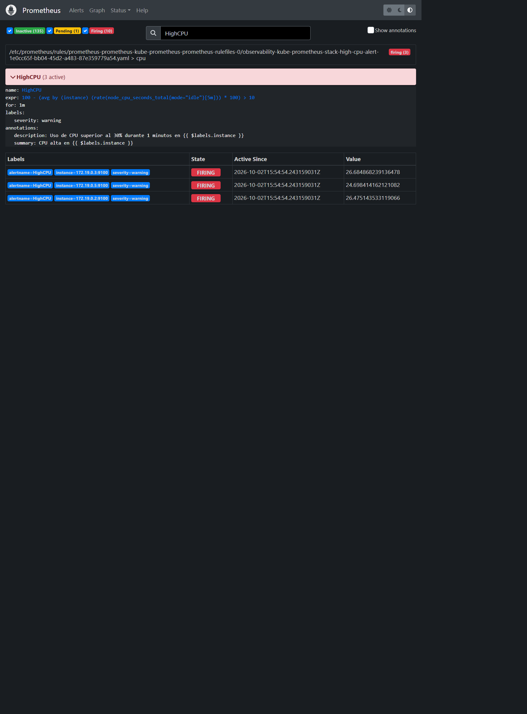
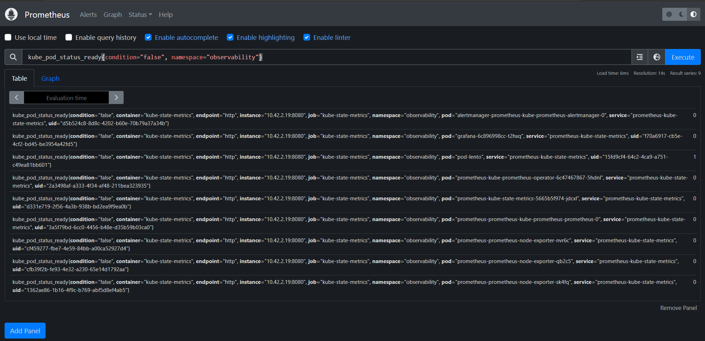
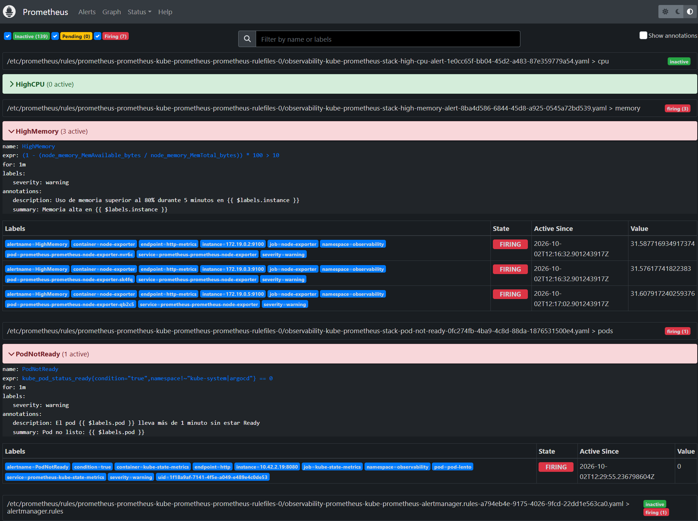
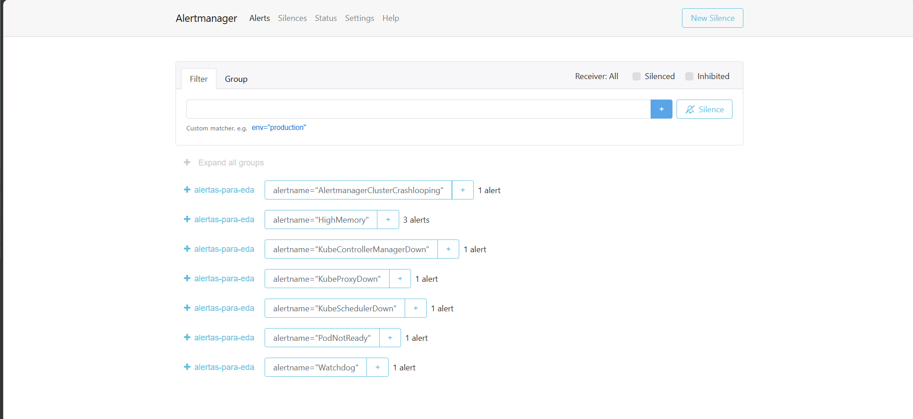
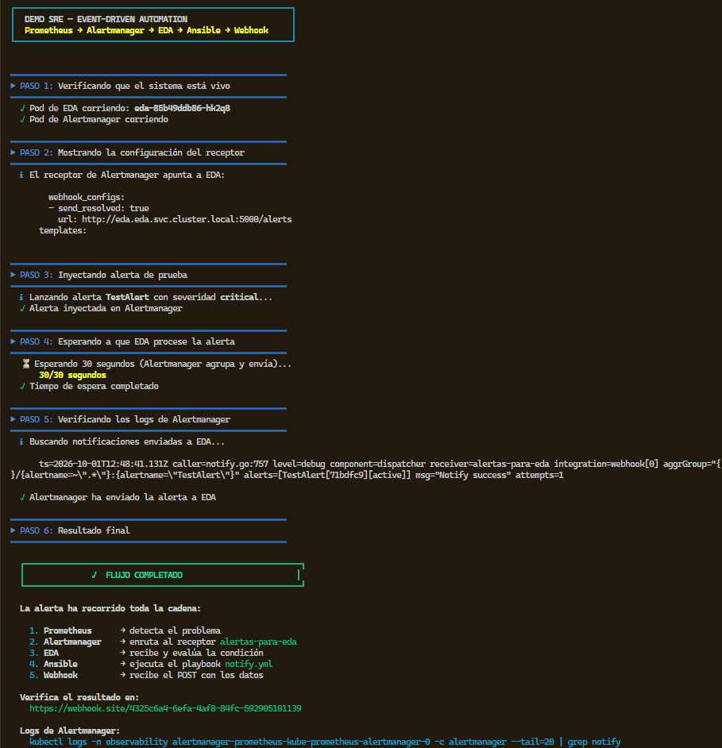
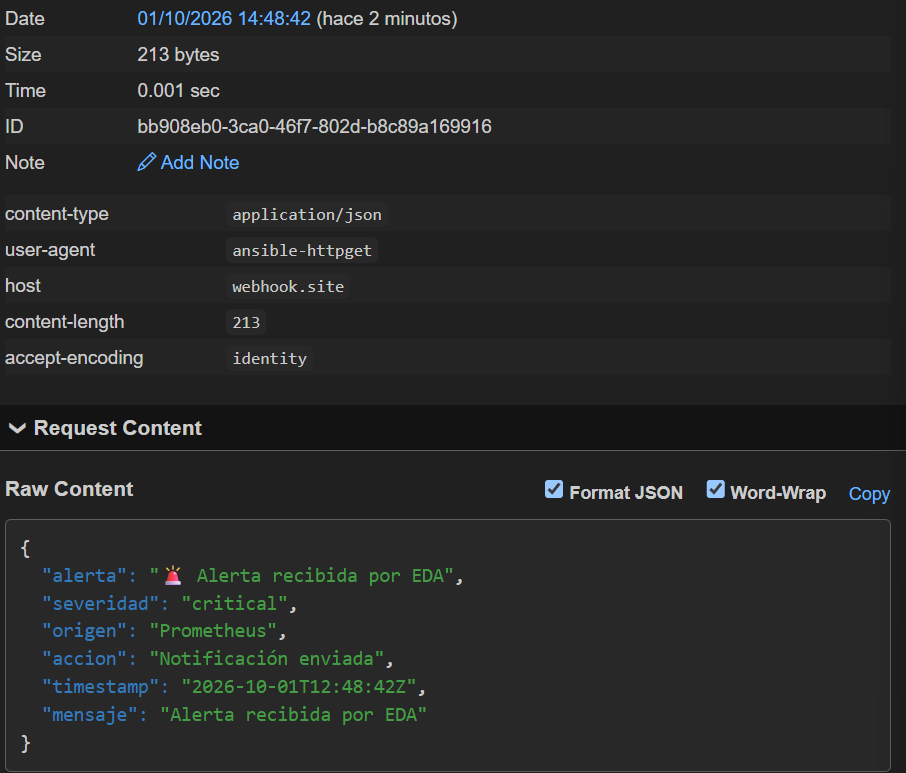

# SRE Observability Platform


Laboratorio reproducible de observabilidad SRE y automatización de alertas en Kubernetes,
gestionado íntegramente como código con GitOps.

---

## Estado del proyecto

✅ **Completado.** Alcance: detección y notificación de alertas.

Un único script levanta desde cero un cluster K3d con ArgoCD, que despliega todo lo demás desde
Git: Prometheus, Alertmanager, Grafana (con datasource y dashboard provisionados), una aplicación
de demostración y EDA (`ansible-rulebook`).

Cuando una alerta propia se dispara, recorre la cadena completa:

```text
Prometheus → Alertmanager → EDA → Ansible → webhook.site
```

El playbook registra y notifica el evento; **no ejecuta acciones correctivas** en Kubernetes.
La remediación automática queda fuera del alcance (ver [Posibles extensiones](#posibles-extensiones)).

### Qué incluye

* Cluster K3d (1 server + 2 agents) recreable desde cero con `bootstrap/bootstrap.sh`
* GitOps con ArgoCD y patrón App-of-Apps (`selfHeal` + `prune`)
* `kube-prometheus-stack`: Prometheus, Alertmanager, Node Exporter y kube-state-metrics
* Grafana como aplicación independiente, con datasource y dashboard *Node Exporter Full* versionados en Git
* Tres reglas de alerta propias: `HighCPU`, `HighMemory` y `PodNotReady`
* Alertmanager enrutando solo esas tres alertas a EDA mediante webhook
* EDA desplegado en el cluster, ejecutando un playbook de Ansible que registra el evento y lo envía a webhook.site
* Script de demo (`demo-eda.sh`) que inyecta una alerta y verifica el recorrido de extremo a extremo
* Prueba de carga con `stress-ng` que llevó `HighCPU` a `firing` en tres instancias
* [Informe del diagnóstico](docs/informe-flujo-alertas.md) de los fallos encontrados al montar el flujo

---

## Capturas

### ArgoCD — Aplicaciones desplegadas

Las cinco Applications gestionadas por GitOps, todas en estado `Synced` y `Healthy`.
`root-app` lee la carpeta `bootstrap/` y crea las cuatro hijas: `prometheus`, `grafana`,
`demo-app` y `eda-app`.


### ArgoCD — Login


### Grafana — Dashboard

*Node Exporter Full* tras un rebuild desde cero: el datasource y el dashboard se provisionan
desde Git, sin importar nada a mano.


### Prometheus — HighCPU durante la prueba de estrés

`HighCPU` llegó a `firing` en tres instancias durante una prueba acotada con `stress-ng`.
La captura muestra la regla activa, su expresión y los valores observados.



### Prometheus y Alertmanager con alertas activas

Capturas tomadas al reproducir una alerta de pod no listo.








### Kubernetes

Estado de los pods desplegados en el cluster.


### Demostración del flujo de alertas

Ejecución de `demo-eda.sh`: la alerta recorre Prometheus, Alertmanager, EDA, Ansible y webhook.site.



### Notificación recibida en webhook.site

El playbook de Ansible hace un POST HTTP al webhook con los datos de la alerta. El
`user-agent: ansible-httpget` confirma que el POST lo ha enviado EDA (no un navegador ni
un `curl` manual).



---

## Arquitectura

```text
                          ┌─────────────────────┐
                          │        GitHub       │
                          │  fuente de verdad   │
                          └──────────┬──────────┘
                                     │  pull cada ~3 min
                                     ▼
┌──────────────────┐       ┌─────────────────────┐
│      Usuario     │──────▶│       ArgoCD        │
└──────────────────┘       └──────────┬──────────┘
                                      │  renderiza charts
            ┌───────────────┬─────────┴───────┬───────────────┐
            ▼               ▼                 ▼               ▼
     ┌────────────┐  ┌────────────┐   ┌────────────┐   ┌────────────┐
     │     App    │  │     App    │   │     App    │   │     App    │
     │ prometheus │  │  grafana   │   │  demo-app  │   │  eda-app   │
     └─────┬──────┘  └──────┬─────┘   └──────┬─────┘   └──────┬─────┘
           │                │                │                │
           ▼                ▼                ▼                │
  ┌──────────────────┐ ┌──────────┐   ┌────────────┐          │
  │ Prometheus       │ │ Grafana  │   │  demo-app  │          │
  │ Alertmanager     │ │ + datasrc│   │ + Ingress  │          │
  │ Node Exporter ×3 │ │ + dashbd │   │  (nginx)   │          │
  │ kube-state-metr. │ └──────────┘   └────────────┘          │
  └────────┬─────────┘                                        │
           │  webhook POST a /endpoint                        ▼
           │                                         ┌────────────────┐
           └────────────────────────────────────────▶│      EDA       │
                                                     │ansible-rulebook│
                                                     └───────┬────────┘
                                                             │ run_playbook
                                                             ▼
                                                     ┌────────────────┐
                                                     │    Ansible     │
                                                     │   notify.yml   │
                                                     └───────┬────────┘
                                                             │ POST
                                                             ▼
                                                     ┌────────────────┐
                                                     │  webhook.site  │
                                                     └────────────────┘
```

### Cómo encaja el App-of-Apps

`root-app` no instala Prometheus: instala las **Applications** que instalan Prometheus. Hay
dos capas, cada una con su propio ciclo de sincronización:

```text
bootstrap/root-app.yaml
   └─ Application/root-app          (lee la carpeta bootstrap/ de Git)
        ├─ Application/prometheus   (chart kube-prometheus-stack 55.0.0 → ns observability)
        ├─ Application/grafana      (chart grafana 7.0.19            → ns observability)
        ├─ Application/demo-app     (chart local                     → ns applications)
        ├─ Application/eda-app      (chart local                     → ns eda)
        └─ los 4 Namespaces
```

Un único sentido de cambio: **Git → cluster**. Si editas algo con `kubectl edit`, Argo lo
sobrescribe con la versión de Git en cuanto lo detecta (`selfHeal: true`).

---

## Stack

| Capa                  | Tecnología                    | Para qué                              |
| --------------------- | ----------------------------- | ------------------------------------- |
| **Contenedores**      | Docker                        | Motor de contenedores                 |
| **Orquestación**      | Kubernetes (K3d)              | Cluster local                         |
| **GitOps**            | ArgoCD 3.5.3                  | Despliegue desde Git                  |
| **Ingress**           | Nginx Ingress                 | Exponer servicios                     |
| **Métricas**          | Prometheus + Node Exporter    | Recoger métricas                      |
| **Estado Kubernetes** | kube-state-metrics            | Métricas de objetos Kubernetes        |
| **Dashboards**        | Grafana 10.2.2                | Datasource y dashboard desde Git      |
| **Alertas**           | Alertmanager                  | Gestionar y enrutar alertas           |
| **Automatización**    | EDA (ansible-rulebook) 1.3.2  | Recibir alertas y lanzar playbooks    |
| **Playbook**          | Ansible                       | Registrar y notificar eventos         |

---

## Estructura del proyecto

```text
sre-observability-platform/
│
├── bootstrap/
│   ├── bootstrap.sh          # crea el cluster, instala ArgoCD/CRDs/ingress y abre la UI
│   ├── stop-portforwards.sh  # detiene los port-forward lanzados por el bootstrap
│   ├── namespaces.yaml       # argocd, observability, applications, eda
│   ├── argocd-apps.yaml      # las 4 Applications hijas + values de cada chart
│   └── root-app.yaml         # Application raíz (App-of-Apps)
│
├── gitops/
│   └── helm/
│       ├── demo-app/         # chart local de la app de demostración
│       └── eda/              # chart local de EDA (ansible-rulebook)
│           ├── Chart.yaml
│           ├── values.yaml
│           ├── files/
│           │   ├── notify.yml       # playbook de Ansible (registro + POST a webhook.site)
│           │   └── inventory.yml    # inventario de Ansible (localhost)
│           └── templates/
│               ├── configmap.yaml   # rulebook inline + notify.yml + inventory.yml
│               ├── deployment.yaml  # ansible-rulebook con --rulebook y --inventory
│               └── service.yaml     # expone el webhook en :5000
│
├── docs/
│   ├── informe-flujo-alertas.md   # diagnóstico de los fallos del flujo de alertas
│   └── screenshots/
│
├── demo-eda.sh                # demo del flujo completo con verificación
├── k3d-config.yaml            # 1 server + 2 agents, traefik deshabilitado
└── README.md
```

> **Las CRDs del Prometheus Operator no están en el repo a propósito.** `bootstrap.sh` las
> descarga del chart publicado y las aplica con `kubectl apply --server-side`, y ArgoCD
> gestiona el chart con `helm.skipCrds: true` para no adoptarlas. Si las metieras en Git,
> Argo pelearía con el operator por su propiedad.

---

## Cómo desplegar

```bash
git clone https://github.com/vramosr1986-gif/sre-observability-platform.git

cd sre-observability-platform

./bootstrap/bootstrap.sh
```

> **Requiere WSL o Linux.** El cluster k3d corre dentro de Docker en WSL, así que `k3d`,
> `helm` y `kubectl` deben estar disponibles **dentro de WSL**, no en PowerShell.

El script es idempotente: si el cluster ya existe, lo borra y lo recrea desde cero. Levanta:

1. Cluster K3d (1 server + 2 agents)
2. Namespaces
3. ArgoCD
4. **CRDs del Prometheus Operator** (descargadas del chart 55.0.0, aplicadas con server-side apply)
5. Nginx Ingress
6. `root-app`, que a su vez sincroniza Prometheus, Grafana, demo-app y EDA
7. Espera a que las 5 Applications queden `Synced` y `Healthy` (hasta 180 s)
8. Levanta los `port-forward` en segundo plano y abre ArgoCD en el navegador

La parte lenta es el paso 6: los charts tardan en renderizarse y Prometheus en ponerse *ready*.
Es normal ver `OutOfSync` durante el primer minuto. Si al terminar ves un aviso de que alguna
Application no convergió en 180 s, el primer despliegue tardó más; espera y vuelve a consultar:

```bash
kubectl get applications -n argocd
```

Lo que debes ver cuando todo ha asentado:

```text
NAME         SYNC STATUS   HEALTH STATUS
demo-app     Synced        Healthy
eda-app      Synced        Healthy
grafana      Synced        Healthy
prometheus   Synced        Healthy
root-app     Synced        Healthy
```

> **Si tocas `bootstrap/argocd-apps.yaml` y no ves cambio en el cluster**, es que `root-app`
> aún no ha recogido el commit. Fuerza el refresco (tarda unos 20 s en propagarse a las hijas):
>
> ```bash
> kubectl annotate application root-app -n argocd argocd.argoproj.io/refresh=hard --overwrite
> ```

---

## Cómo acceder

### Vía port-forward (recomendado)

`bootstrap.sh` los lanza **en segundo plano** con `nohup` al final, así que la terminal queda
libre. Para ver qué puerto acabó sirviendo cada aplicación:

```bash
cat /tmp/sre-lab-portforwards.map
```

| Servicio         | Puerto por defecto | URL                                        |
| ---------------- | ------------------ | ------------------------------------------ |
| **ArgoCD**       | 9090               | https://localhost:9090                     |
| **Grafana**      | 3000               | http://localhost:3000                      |
| **Prometheus**   | 9091               | http://localhost:9091                      |
| **Alertmanager** | 9093               | http://localhost:9093                      |
| **demo-app**     | 8082               | http://localhost:8082                      |
| **EDA**          | 5000               | http://localhost:5000/endpoint (solo POST) |

> Si un puerto ya está ocupado, el script busca el siguiente libre y avisa por pantalla.
> Consulta siempre el fichero `.map` para saber el puerto real.

Para pararlos todos:

```bash
bash bootstrap/stop-portforwards.sh
```

ArgoCD usa certificado autofirmado, así que el navegador mostrará un aviso de
seguridad. Es esperado: pulsa **Advanced → Proceed**.

### Vía Ingress

| Servicio     | Host             | Notas             |
| ------------ | ---------------- | ----------------- |
| **demo-app** | `demo-app.local` | sin autenticación |

Grafana se usa siempre por `http://localhost:3000` (ver la trampa del `root_url` en
[Qué aprendí](#trampas-que-costaron-tiempo)).

El ingress de nginx escucha en la IP del loadbalancer. Para resolver el nombre en local,
añade a tu `hosts` de Windows:

```text
172.19.0.2   demo-app.local
```

La IP puede cambiar en cada recreación del cluster; consíguela con:

```bash
kubectl get ingress -n applications demo-app -o jsonpath='{.status.loadBalancer.ingress[0].ip}'
```

### Credenciales

| Servicio | Usuario | Contraseña |
| -------- | ------- | ---------- |
| ArgoCD   | `admin` | generada en cada arranque (ver abajo) |
| Grafana  | `admin` | `admin` (intencionado: laboratorio local) |

```bash
kubectl -n argocd get secret argocd-initial-admin-secret \
  -o jsonpath="{.data.password}" | base64 -d; echo
```

Como `bootstrap.sh` recrea el cluster cada vez, la contraseña de ArgoCD cambia en cada despliegue.

---

## Grafana

Grafana se despliega como aplicación independiente (chart `grafana` 7.0.19), no como subchart
de `kube-prometheus-stack`. Eso obliga a cablear a mano lo que el stack integrado hacía solo.
Ambas piezas están en los values de la Application `grafana` en `bootstrap/argocd-apps.yaml` y
**sobreviven a cada rebuild**.

### Datasource

```yaml
datasources:
  datasources.yaml:
    apiVersion: 1
    datasources:
      - name: Prometheus
        type: prometheus
        uid: prometheus
        url: http://prometheus-kube-prometheus-prometheus.observability.svc.cluster.local:9090
        isDefault: true
```

Comprobar que responde (debe devolver `"status":"OK"`):

```bash
curl -s -u admin:admin http://localhost:3000/api/datasources/uid/prometheus/health
```

### Dashboard

*Node Exporter Full* ([grafana.com 1860](https://grafana.com/grafana/dashboards/1860)) se
descarga al arrancar el pod y se provisiona desde fichero, apuntando al datasource `Prometheus`:

```yaml
dashboards:
  default:
    node-exporter-full:
      gnetId: 1860
      revision: 37
      datasource: Prometheus
```

Requiere salida a Internet desde el cluster (un init container hace la descarga).

---

## Monitorización

Prometheus recopila métricas de:

* Kubernetes API Server
* Kubelet
* cAdvisor
* CoreDNS
* kube-state-metrics
* Node Exporter
* Prometheus
* Alertmanager
* Prometheus Operator

Comprobar el estado de los targets desde la UI de Prometheus, o por CLI:

```bash
PROM=$(kubectl get pod -n observability -l app.kubernetes.io/name=prometheus \
  -o jsonpath='{.items[0].metadata.name}')

kubectl exec -n observability "$PROM" -c prometheus -- \
  wget -qO- 'http://localhost:9090/api/v1/query?query=count(up%20%3D%3D%201)'
```

---

## Alertas

### Reglas propias

Tres reglas definidas en `bootstrap/argocd-apps.yaml` dentro de `additionalPrometheusRulesMap`
y desplegadas como objetos `PrometheusRule`:

| Alerta        | Grupo    | Qué detecta                                                        |
| ------------- | -------- | ------------------------------------------------------------------ |
| `HighCPU`     | `cpu`    | Uso de CPU > 10% durante 1 minuto por instancia                    |
| `HighMemory`  | `memory` | Memoria usada > 10% durante 1 minuto por nodo                      |
| `PodNotReady` | `pods`   | Pod no listo durante 1 minuto, excluyendo `kube-system` y `argocd` |

> **Los umbrales del 10% son de demostración**, elegidos para que las alertas se disparen en un
> cluster local con poca carga y poder ver el flujo completo. En un entorno real estarían en
> torno al 80–90%.

```yaml
additionalPrometheusRulesMap:
  high-cpu-alert:
    groups:
      - name: cpu
        rules:
          - alert: HighCPU
            expr: |
              100 - (
                avg by(instance) (
                  rate(node_cpu_seconds_total{mode="idle"}[5m])
                ) * 100
              ) > 10
            for: 1m
            labels:
              severity: warning
```

Verificar que están cargadas y evaluándose:

```bash
kubectl exec -n observability "$PROM" -c prometheus -- \
  wget -qO- 'http://localhost:9090/api/v1/rules'
```

> **Ruido esperado en K3d:** algunas reglas predeterminadas del chart pueden aparecer en `firing`
> porque el clúster local no expone todos los targets del control plane. Por eso el enrutamiento
> a EDA se limita a las tres alertas propias.

### Receptor de Alertmanager

Alertmanager envía a EDA únicamente las alertas propias mediante una subruta con allowlist. El
receptor `default` no tiene integraciones:

```yaml
alertmanager:
  config:
    route:
      receiver: default
      group_by:
        - alertname
      group_wait: 10s
      group_interval: 30s
      repeat_interval: 30s
      routes:
        - receiver: alertas-para-eda
          matchers:
            - alertname =~ "^(HighCPU|HighMemory|PodNotReady)$"
    receivers:
      - name: default
      - name: alertas-para-eda
        webhook_configs:
          - url: http://eda.eda.svc.cluster.local:5000/endpoint
            send_resolved: true
  alertmanagerSpec:
    logLevel: debug
```

* La expresión regular enruta solo `HighCPU`, `HighMemory` y `PodNotReady` a EDA.
* `send_resolved: true` notifica también cuando la alerta se resuelve.
* `group_interval` y `repeat_interval` de 30 s permiten iterar rápido durante la demo.
* `logLevel: debug` hace visibles las entregas en los logs.

Verificar la entrega a EDA en los logs de Alertmanager:

```bash
kubectl logs -n observability alertmanager-prometheus-kube-prometheus-alertmanager-0 -c alertmanager --tail=30 \
  | grep -i "notify\|webhook\|error"
```

```text
level=debug component=dispatcher receiver=alertas-para-eda integration=webhook[0] msg="Notify success" attempts=1
```

---

## Automatización de alertas (EDA)

EDA está desplegado como una Application más de ArgoCD (`eda-app`), con su propio chart en
`gitops/helm/eda/`. La imagen es `quay.io/ansible/ansible-rulebook:v1.3.2`.

El ConfigMap `eda-rulebook` monta tres ficheros en `/rulebook/` dentro del pod:

| Fichero         | Fuente en el repo                  | Qué contiene                                  |
| --------------- | ---------------------------------- | --------------------------------------------- |
| `rulebook.yml`  | inline en `templates/configmap.yaml` | Qué escucha EDA y cómo reacciona            |
| `notify.yml`    | `files/notify.yml`                 | El playbook de Ansible que se ejecuta         |
| `inventory.yml` | `files/inventory.yml`              | Inventario de Ansible (`localhost`)           |

### El rulebook

```yaml
---
- name: Reaccionar a alertas
  hosts: localhost
  sources:
    - ansible.eda.alertmanager:
        host: 0.0.0.0
        port: 5000
      filters:
        - eda.builtin.json_filter:
            exclude_keys:
              - hosts
  rules:
    - name: Alertas SRE
      condition: event.alert.labels.alertname in ["HighCPU", "HighMemory", "PodNotReady"]
      action:
        run_playbook:
          name: /rulebook/notify.yml
```

* `ansible.eda.alertmanager` entiende el formato de Alertmanager y genera un evento por cada
  alerta del array `alerts`.
* `json_filter` excluye la clave `hosts` del evento. Sin él, EDA limita el playbook al valor de
  la etiqueta `instance` y Ansible responde `no hosts matched`.
* `condition` acepta solo las tres alertas propias.
* `run_playbook` ejecuta `/rulebook/notify.yml`.

### El playbook (`notify.yml`)

Hace dos cosas por cada alerta:

1. Añade un bloque con los datos del evento (alerta, severidad, estado, instancia, pod,
   namespace, regla, hora de recepción y UUID) a `/tmp/eventos.txt` con `blockinfile`.
2. Envía el payload JSON a webhook.site con `ansible.builtin.uri`.

```yaml
- name: Enviar alerta propia a webhook.site
  ansible.builtin.uri:
    url: https://webhook.site/<token>
    method: POST
    body_format: json
    body:
      source: prometheus-alertmanager
      alertname: "{{ ansible_eda.event.alert.labels.alertname }}"
      status: "{{ ansible_eda.event.alert.status | default('unknown') }}"
      severity: "{{ ansible_eda.event.alert.labels.severity | default('unknown') }}"
      labels: "{{ ansible_eda.event.alert.labels }}"
      annotations: "{{ ansible_eda.event.alert.annotations | default({}) }}"
    status_code: [200, 201, 202]
```

Para consultar los eventos registrados:

```bash
kubectl exec -n eda deploy/eda -- cat /tmp/eventos.txt
```

### Script de demo

`demo-eda.sh` comprueba que EDA y Alertmanager están vivos, inyecta con `amtool` una alerta
`HighCPU` con una instancia única (`demo-eda-HHMMSS`), espera a que Alertmanager la entregue y
**verifica que el evento aparece en `/tmp/eventos.txt`**. Si no aparece, termina con error.

```bash
./demo-eda.sh
```

---

## Qué aprendí

* **Kubernetes**: pods, services, namespaces, ingress, CRDs y StatefulSets
* **K3d**: Kubernetes dentro de Docker
* **GitOps con ArgoCD**: sincronización desde Git, `selfHeal`, `prune` y App-of-Apps
* **Helm**: charts, values, templates y `.Files.Get` para ficheros externos
* **Prometheus**: métricas, PromQL, ServiceMonitors y PrometheusRules
* **Grafana**: datasources y dashboards provisionados como código
* **Alertmanager**: rutas, receptores, webhooks y modo debug
* **EDA**: `ansible-rulebook`, sources, filtros, condiciones, acciones e inventario
* **Ansible**: playbooks, inventario y módulo `ansible.builtin.uri`

### Trampas que costaron tiempo

Para el análisis detallado del flujo de alertas, consulta el
[informe del flujo de alertas](docs/informe-flujo-alertas.md).

**`syncOptions` cambió de sitio en ArgoCD v3.** En v2.x era `spec.syncOptions`; desde v3 la
ruta válida es `spec.syncPolicy.syncOptions`. Con el layout antiguo, el API server hace
*structural schema pruning* y **descarta el campo en silencio**. El síntoma es un `root-app`
que se queda `OutOfSync` para siempre mientras Argo reporta `successfully synced`. La pista
está en el log del controller:

```bash
kubectl logs -n argocd argocd-application-controller-0 --since=5m | grep 'unknown field'
```

**Un bucle de reconciliación puede *parecer* sano.** El mensaje de éxito del sync se refiere
a que la operación se ejecutó, no a que el cluster haya cambiado. La señal fiable es que
`status.sync.status` llegue a `Synced` y **se quede** ahí.

**Un cambio en `bootstrap/argocd-apps.yaml` se aplica refrescando `root-app`, no la app hija.**
Las apps hijas leen su propio chart; los values viven en `argocd-apps.yaml`, y solo `root-app`
los lee. Se detecta mirando el `Revision`: la app hija muestra la **versión del chart**, no un
commit.

```bash
kubectl get application prometheus -n argocd -o jsonpath='{.status.sync.revision}'
# → 55.0.0   (no es un commit, es la versión del chart)
```

**`helm template` antes de commitear.** Un error de indentación en un `ConfigMap` no se detecta
hasta que Argo intenta renderizar el chart, y el mensaje es mucho menos claro:

```bash
helm template eda gitops/helm/eda
```

**El `root_url` de Grafana decide si la UI funciona.** El chart viene con
`domain = grafana.local`; si abres la UI por `localhost:3000`, el navegador pide contra
`grafana.local`, que no resuelve, y cada llamada a la API muere con `Failed to fetch`, aunque
el datasource y su health check estén bien. Se fijó `root_url: http://localhost:3000`, lo que a
cambio deja inservible el ingress de Grafana. Se diagnostica así:

```bash
curl -s -u admin:admin http://localhost:3000/api/frontend/settings | grep -o '"appUrl":"[^"]*"'
```

**EDA limita el playbook con `event.meta.hosts`.** El source de Alertmanager rellena `hosts` con
la etiqueta `instance` (`172.19.0.2:9100`), y Ansible no la reconoce como host. Meter esas
direcciones en el inventario no funciona; la solución es excluir la clave `hosts` con
`json_filter` (la clave, no la ruta `meta.hosts`).

**Un `run_playbook` necesita inventario, siempre.** Aunque solo haya `localhost`, sin
`--inventory` EDA falla al arrancar:

```text
ERROR - Terminating: Rule ... has an action run_playbook which needs inventory to be defined
```

**`Notify success` no significa que el playbook funcionara.** Confirma que Alertmanager entregó
el webhook a EDA; el resultado del playbook se ve en los logs de EDA y en `/tmp/eventos.txt`.

**Intervalos cortos y webhooks externos.** `group_interval` y `repeat_interval` usan unidades
explícitas (`30s`, no `30`). Con valores tan bajos, webhook.site acabó respondiendo HTTP 429.

**`HighCPU` usa una ventana de 5 minutos y `for: 1m`.** Una prueba de carga breve puede elevar
el uso del nodo sin que la alerta llegue a `firing`.

**Una anotación de refresh en ArgoCD es *one-shot*.** Argo la lee una vez y la borra. Sirve para
forzar un refresh sin esperar al polling (~3 min); los cambios permanentes van en Git.

---

## Posibles extensiones

El proyecto cumple su alcance. Estas son direcciones naturales para continuarlo:

* **Remediación automática**: que el playbook actúe sobre Kubernetes (reiniciar o escalar un
  deployment) y verifique el resultado.
* **Persistencia de eventos**: llevar `/tmp/eventos.txt` a un volumen o a un backend externo.
  Ahora mismo vive en el filesystem efímero del pod.
* **Logs centralizados**: Loki o Elasticsearch.
* **Métricas de aplicación**: instrumentar `demo-app` y añadir un `ServiceMonitor`.
* **Gestión de secretos**: Sealed Secrets o External Secrets para las credenciales y el token
  del webhook.
* **Tests de infraestructura**: validación de charts en CI (`helm lint`, `kubeconform`).
* **Despliegue en cloud** (AWS, Azure o GCP).

---

## Autor

**Victor Ramos** — [@vramosr1986-gif](https://github.com/vramosr1986-gif)

Proyecto de aprendizaje y experimentación con **SRE, Kubernetes, GitOps, observabilidad y automatización**.
